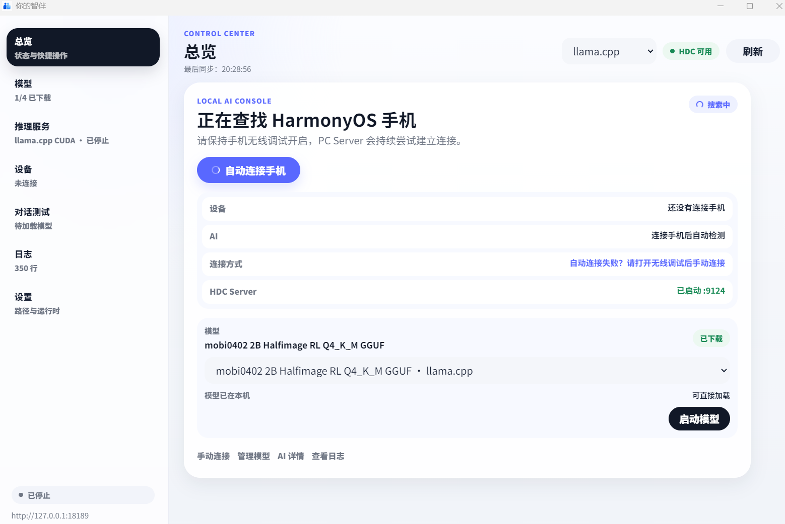

<p align="center">
  
</p>

<h3 align="center">
ClawMate: A Proactive On-Device Agent System
</h3>

<p align="center">
| <a href="https://arxiv.org/abs/2509.00531"><b>MobiAgent Paper</b></a> | <a href="https://arxiv.org/abs/2512.15784"><b>MobiMem Paper</b></a> | <a href="https://huggingface.co/collections/IPADS-SAI/mobimind-68b2aad150ccafd9d9e10e4d"><b>Hugging Face</b></a> | <a href="https://github.com/doulujiyao12/mobiinfer"><b>MobiInfer</b></a> |
</p>

<p align="center">
  <a href="README.en.md">English</a> | <a href="README.md">中文</a>
</p>

-----

## About

- Target platform: HarmonyOS NEXT.
- HarmonyOS App: source build only. No prebuilt HAP is provided.
- Desktop App: source build and prebuilt installers are available.
- On-device inference: [MobiInfer](https://github.com/doulujiyao12/mobiinfer).
- Audience: developers.

Prerequisites:

- HarmonyOS NEXT
- DevEco Studio + HarmonyOS Native SDK
- Python 3.10+

<p align="center">


</p>

## News

- [2026.7.18] ClawMate HarmonyOS App and ClawMate Desktop are open-sourced.

### Demo Videos

<table>
  <tr>
    <td align="center" width="25%">
      <video src="https://github.com/user-attachments/assets/399e4dea-b28c-4051-b684-85521a3b4800" controls width="220"></video>
      <br><small>Collect and organize phone data automatically</small>
    </td>
    <td align="center" width="25%">
      <video src="https://github.com/user-attachments/assets/80949978-e29e-48e0-91b1-14f60c2701c7" controls width="220"></video>
      <br><small>Exchange personal profiles with tap-to-share</small>
    </td>
    <td align="center" width="25%">
      <video src="https://github.com/user-attachments/assets/91e84083-a8b8-4cfe-b3ee-f4426d0ce1e7" controls width="220"></video>
      <br><small>Agent-operated phone task: ordering drinks</small>
    </td>
    <td align="center" width="25%">
      <video src="https://github.com/user-attachments/assets/c46ef03b-58b2-4f3a-98ae-bda7f20890ab" controls width="220"></video>
      <br><small>Buying a Huawei Pura X with Qwen</small>
    </td>
  </tr>
</table>

## Installation

### HarmonyOS App

The HarmonyOS App source is managed as a Git submodule under `clawmate-harmonyAPP/`.

```bash
git submodule update --init clawmate-harmonyAPP
```

Source repository: [clawmate-harmonyAPP](https://github.com/doulujiyao12/mobiinfra-oh/tree/clawmate_dev)

#### Development Environment

1. Install [DevEco Studio](https://developer.huawei.com/consumer/cn/deveco-studio/). Use a version that supports HarmonyOS NEXT / API 20+.
2. Install the matching HarmonyOS Native SDK in `Settings/Preferences > SDK > HarmonyOS > SDK Platforms`.
3. Add the `hdc` toolchain directory to `PATH`, then verify `hdc list targets`.
4. Python 3.10+.

#### Build and Run

Use DevEco Studio:

1. Open the repository root.
2. Let DevEco Studio generate `build-profile.json5` on first build.
3. Configure automatic signing or a local debug signing profile.
4. Select the `entry` module and the target device.
5. Click Run / Debug to install on a HarmonyOS NEXT device.

### Desktop App

Download prebuilt installers from the [Release page](https://github.com/IPADS-SAI/ClawMate/releases).

| Platform | Download |
|--|--|
| macOS (Apple Silicon) | ClawMate-desktop-mac-arm64.dmg |
| Windows | ClawMate-desktop-windows-x64.exe |
| Linux | ClawMate-desktop-linux-x64.AppImage |

- Windows: run the `.exe` installer.
- macOS: open the `.dmg` and drag the app to Applications.
- Linux: mark the `.AppImage` executable and run it.

On first launch, bundled configuration is copied to the user data directory. Models, logs, and cache are stored in the system user data directory, not inside the install directory.

To build the desktop app from source, see [build.md](docs/build.md).

### On-Device Inference Engine

- Inference engine: [MobiInfer](https://github.com/doulujiyao12/mobiinfer)
- Quantization tool: [mobi-autoround](https://github.com/doulujiyao12/mobi-autoround)
- Model source: [MobiMind](https://www.modelscope.cn/models/fengerhu1/MobiMind-1.5-2B-W8A8-0717)
- Runtime management: handled by ClawMate Desktop.
